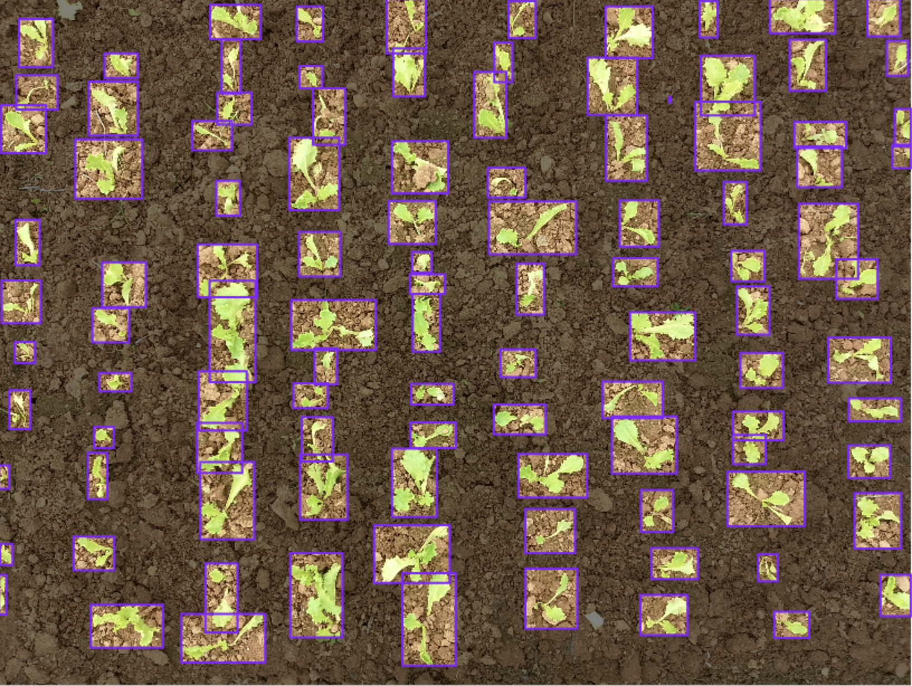
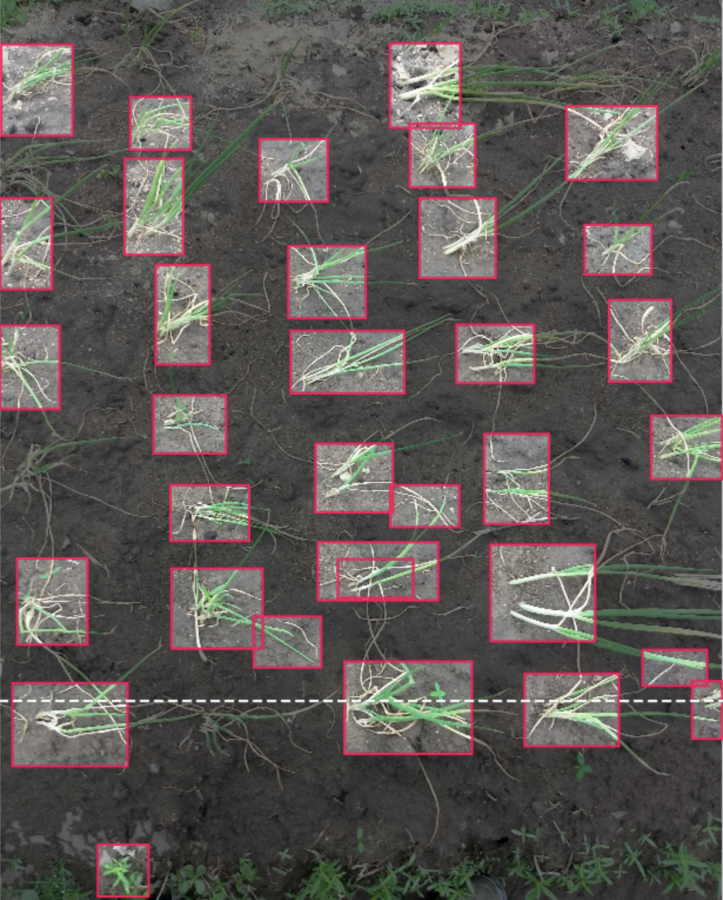

# RF-DETR Training & Inference on Modal

Train and run inference on [RF-DETR](https://github.com/roboflow/rf-detr) — Roboflow's real-time transformer-based object detector — on a serverless GPU with [Modal](https://modal.com). No local GPU required.

This repo is the companion code to the YouTube walkthrough: **[link coming soon]**.

<p align="center">
  
  
</p>

---

## What this demo shows

- Pulling a labeled object-detection dataset from Roboflow Universe
- Fine-tuning **RF-DETR Nano** on an L4 GPU in the cloud
- Persisting the dataset and trained checkpoints to a Modal Volume
- Running inference against the trained checkpoint on demand

The full pipeline lives in a single file — `rfdetr_training_inference.py` — so it's easy to read along with the video.

---

## Prerequisites

You'll need free accounts and CLI access for both:

| Service       | Why                                  | Sign up                              |
| ------------- | ------------------------------------ | ------------------------------------ |
| **Modal**     | Serverless GPU runtime               | https://modal.com/signup             |
| **Roboflow**  | Source of the labeled dataset        | https://app.roboflow.com/            |

Plus [`uv`](https://docs.astral.sh/uv/) for Python dependency management.

---

## Setup

### 1. Clone and install

```bash
git clone https://github.com/<your-username>/rfdetr-training-inference.git
cd rfdetr-training-inference
uv sync
```

### 2. Authenticate with Modal

```bash
uv run modal setup
```

### 3. Add your Roboflow API key as a Modal secret

Grab your key from https://app.roboflow.com/settings/api, then:

```bash
uv run modal secret create roboflow-api-key ROBOFLOW_API_KEY=<your-key>
```

The function decorator looks this secret up by name — see `rfdetr_training_inference.py:48`.

---

## Run it

Kick off the full pipeline (dataset download → training):

```bash
uv run modal run rfdetr_training_inference.py
```

Modal will build the container image on first run (a few minutes), then stream training logs from the L4 GPU. Checkpoints land at `/root/data/checkpoints` inside the persisted volume.

---

## Configuration

All knobs live at the top of `rfdetr_training_inference.py`:

```python
EPOCHS = 10
BATCH_SIZE = 4
GRAD_ACCUM_STEPS = 2

TRAIN_GPU = "L4"
TRAIN_CPU_COUNT = 4
INFERENCE_GPU = "L4"
```

Modal supports a wide range of GPUs — bump `TRAIN_GPU` to `"A100"` or `"H100"` for larger datasets or faster epochs. See the [Modal GPU reference](https://modal.com/docs/guide/gpu).

The dataset is selected inside `main()`:

```python
config = DatasetConfig(
    workspace_id="roboflow-100",
    project_id="vehicles-q0x2v",
    version=2,
    format="coco",
    target_class="vehicle",
)
```

Swap any Roboflow Universe project here. The Roboflow URL `https://universe.roboflow.com/<workspace>/<project>/dataset/<version>` maps directly onto these fields.

---

## How it works

```
┌────────────────────┐     ┌──────────────────┐     ┌──────────────────┐
│ download_dataset() │ ──► │     train()      │ ──► │    infer()       │
│  Roboflow API      │     │  RFDETRNano on   │     │ load checkpoint, │
│  → Modal Volume    │     │  L4 GPU          │     │ run prediction   │
└────────────────────┘     └──────────────────┘     └──────────────────┘
              shared `rfdetr_training_volume` (Modal Volume)
```

Each function is decorated with `@app.function(...)` and runs in its own container. The Modal Volume mounted at `/root/data` keeps the dataset and checkpoints around between runs so you don't re-download or re-train every time.

Note: heavyweight imports (`rfdetr`, `roboflow`) are deferred to inside the function bodies because they're only installed in the remote container image, not locally.

---

## File layout

```
.
├── rfdetr_training_inference.py   # The whole pipeline
├── pyproject.toml                 # Dependencies (uv-managed)
├── uv.lock
└── README.md
```

---

## Costs

Modal grants new accounts $30/month of free compute, which is plenty for this demo. An L4 training run on the example dataset (~10 epochs) finishes in a few minutes and costs cents.

---

## Troubleshooting

- **`Secret 'roboflow-api-key' not found`** — re-run the secret-create command in Setup step 3.
- **Build is slow on first run** — Modal caches the image after the first build; subsequent runs start in seconds.
- **OOM during training** — drop `BATCH_SIZE` or bump to a larger GPU.

---

## License

MIT
